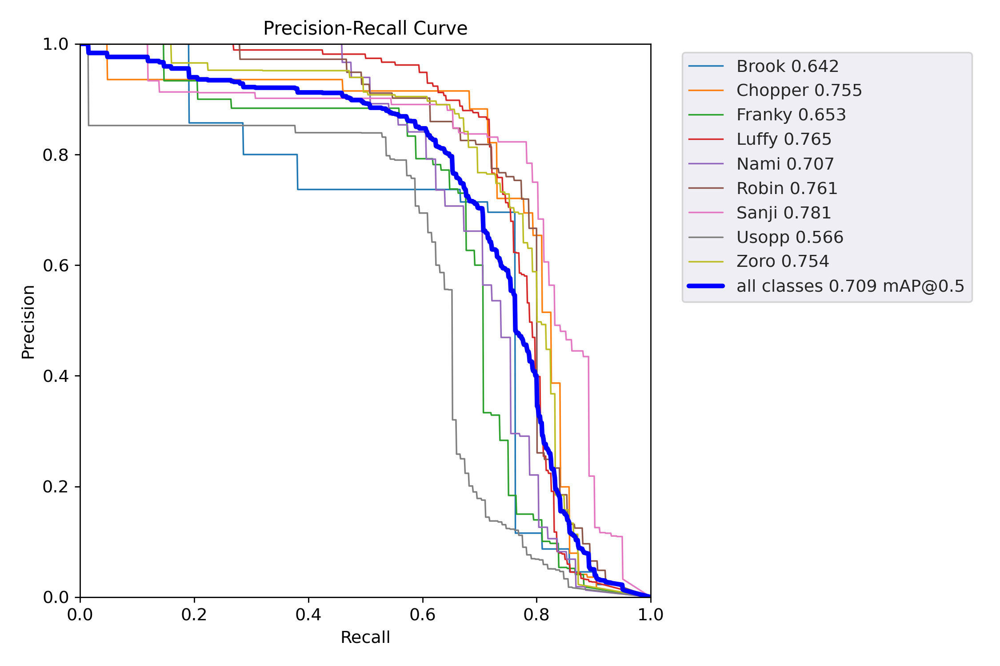
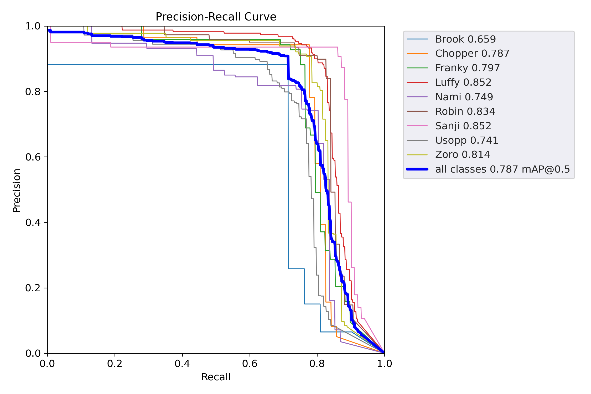
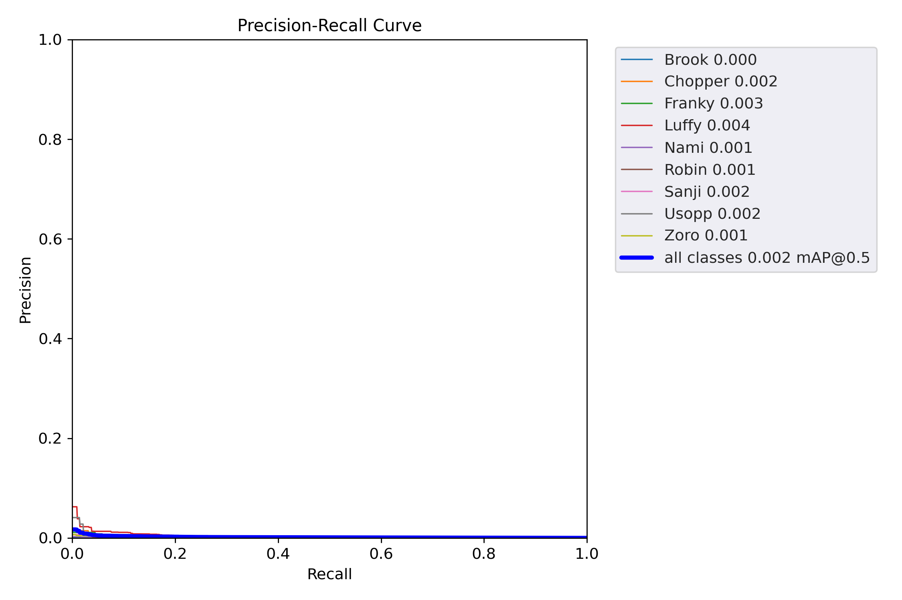
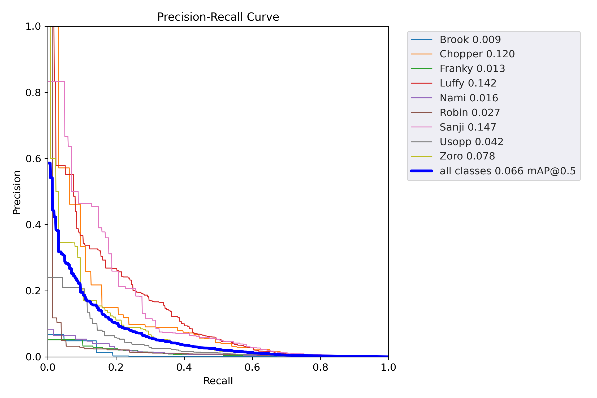

# 
 One Piece Character Detection 

by Capybarista Team

     

# Brief Result:

- Model comparison with mAP@0.5 score and Running time
   - roboflow (Default) - (0.7)
   - Yolov5l - Weight False Freeze False (0.709 / 5.36 hr)
   - Yolov5l - Weight True Freeze False (0.787 / 5.35 hr)
   - Yolov5l - Weight False Freeze True (0.002 / 2.42 hr)
   - Yolov5l - Weight True Freeze True (0.066 / 2.43 hr)
   - Yolov5l - Weight True Freeze 10 (0.673 / 3.22 hr)
   - Yolov5s - Weight True Freeze True (ยังไม่เสร็จ)

- The Best Model (Highest score) = Yolov5l - Weight True Freeze False (Unfreeze Model + Adjust weight from pre-train result)
- Alternative model (Balance between score and running time) = Yolov5l - Weight True Freeze 10

# Introduction:
- Object detection: Object detection is a computer vision technique that allows us to identify and locate objects in an image or video. 
With this kind of identification and localization, object detection can be used to count objects in a scene and determine and track their precise locations, 
all while accurately labeling them. The comparison between image classification, object detection, and instance segmentation is shown below.

     

from: Standford University 2016 winter lectures CS231n Fei-Fei Li & Andrej Karpathy & Justin Johnson

- YOLOv5: YOLO an acronym for 'You only look once, is an object detection algorithm that divides images into a grid system. 
Each cell in the grid is responsible for detecting objects within itself. YOLO is one of the most famous object detection algorithms due to its speed and accuracy.

Link for more detail: https://docs.ultralytics.com/ , https://github.com/ultralytics/yolov5 , https://pypi.org/project/yolov5/

- roboflow: Roboflow is a computer vision platform that allows users to build computer vision models faster and more accurately through the provision of better data collection, preprocessing, 
and model training techniques. Roboflow allows users to upload custom datasets, draw annotations, modify image orientations, resize images, modify image contrast and perform data augmentation. 
It can also be used to train models.

     

Image augmentation is an efficacious technique when we don’t have an ample amount of data for training a deep learning model. 
Our team do Image augmentation with roboflow (due to time limitation, we set criteria of image augmentation as default of roboflow). Following figure is image augmentation options in roboflow.

     
     
Step of roboflow for One Piece Character Detection Project
1. Upload photo to roboflow
2. Label One Piece Character in all photos.
3. Image preprocessing & Image augmentation
4. Train.
5. Deploy.

     

Image source and detail of roboflow tutorial --> https://blog.streamlit.io/how-to-use-roboflow-and-streamlit-to-visualize-object-detection-output/

# Our project in roboflow:
- Project Link: https://app.roboflow.com/dl-yjboe/dads7202_hw2
- Total image = 1182 pictures (Number of photos for each character shown below. Some pictures have multi-character)
- Number of photos after image augmentation = 11232
- Train-Test Split = 70 : 20 : 10 --> After Image augmentation, Train : Validation : Test : 87% : 8% : 5%
- Other settings are shown below

     

     

# roboflow's outcome:
- mAP for Train / Validation /Test of all character  = 71% / 68% / 70%

     

However, roboflow have tuning limitation. Next step, team will use jupyter in colab to adjust hyperparameter.

---------------------------------------------------

# Our project in jupyter-colab:
- Project Link: https://colab.research.google.com/drive/1hfHihyPVFt18axpft3brB-uG-jAQ9OoM?usp=sharing#scrollTo=ii8qC1HDUzZ6
มีของ yolov5s จะแยกหรือร่วม colab
- 6 Comparison base on batch-size = 16 and 100 epochs (default)
   - Yolov5l - Weight False Freeze False (unfreeze layer + No update weight via pretrain step)
   - Yolov5l - Weight True Freeze False (unfreeze layer + Allow to update weight via pretrain step)
   - Yolov5l - Weight False Freeze True (Freeze all layers (except output layer) + No update weight via pretrain step)
   - Yolov5l - Weight True Freeze True (Freeze all layers (except output layer) + Allow to update weight via pretrain step)
   - Yolov5l - Weight True Freeze 10 (Freeze backbone = 10 layer + No update weight via pretrain step)
   - Yolov5s - Weight True Freeze True (Freeze all layers (except output layer) + Allow to update weight via pretrain step + Change to Yolov5s) (ยังไม่เสร็จ)

# mAP@0.5 score from Jupyter-colab:
   - Yolov5l - Weight False Freeze False = 0.709

     

   - Yolov5l - Weight True Freeze False = 0.787

     

   - Yolov5l - Weight False Freeze True = 0.002

     

   - Yolov5l - Weight True Freeze True = 0.066

     

   - Yolov5l - Weight True Freeze 10 = 0.673 

     

   - Yolov5s - Weight True Freeze True (ยังไม่เสร็จ)

# Jupyter-colab's outcome:
- The best score model = Yolov5l - Weight True Freeze False, 0.787
- However, running time is high. The running time of each model is shown below

     

- Alternative model (Balance between score and running time) = Yolov5l - Weight True Freeze 10 (Score drop ~15% but save time ~40%)
- Observation: 
   - Score: unfreeze layer model  > freeze layer model
   - Score: allow to update weight model  > No update weight model
   - Running time: unfreeze layer model  > freeze layer model
   - Score: allow to update weight model  ~ No update weight model

# Next step:
- Add number of photos
- Use more features of image augmentation (Cutout, Grayscale, ...)
- Create standard of Labelling 
- Comparison to other versions of YoloV5 (YoloV5m,  YoloV5x, ...)
-
---------------------------------------------------

# Reference:
- Yolov5: https://github.com/ultralytics/yolov5
- C3 model: https://arxiv.org/abs/1812.04920

---------------------------------------------------

# Capybarista Team member:
- ธีรนาถ ศรีงามดี
- พัชรพฤกษ์ วัฒนางกูร
- Nattapong Thanngam_6310422089 
- สุกิจ วาณิชฤดี_6310422092 
- อร มินเทียร์

-  
- 6410414001 
- 6410412007 
- 6410412014 
